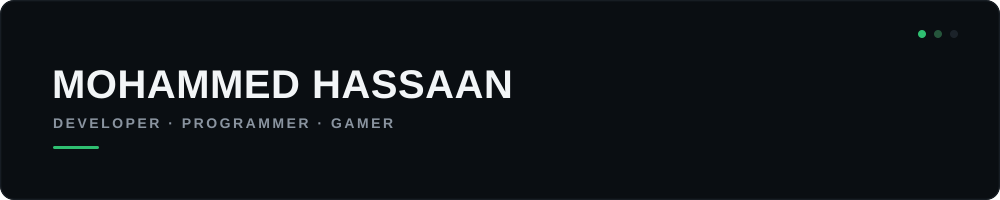
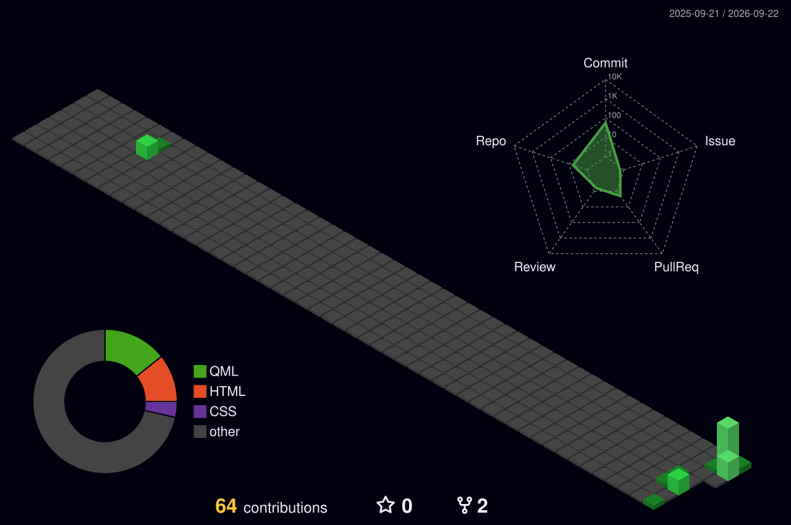

  

  

---

## 👋 Hey, I'm Hassaan

I'm a **Developer • Programmer • Gamer** who enjoys building things, experimenting with technology, and turning ideas into projects.

I like working across different areas of software development — from programming and web development to AI/ML and cloud technologies.

### 🧠 Currently Learning

**Machine Learning**

Learning the fundamentals, experimenting with models, and turning what I learn into projects.

---

## ⚡ Tech Stack

<table>
<tr>

<td align="center">
 
<b>C</b>
</td>

<td align="center">
 
<b>C++</b>
</td>

<td align="center">
 
<b>Java</b>
</td>

<td align="center">
 
<b>Python</b>
</td>

<td align="center">
 
<b>HTML</b>
</td>

<td align="center">
 
<b>CSS</b>
</td>

<td align="center">
 
<b>JavaScript</b>
</td>

<td align="center">
 
<b>Node.js</b>
</td>

<td align="center">
 
<b>React</b>
</td>

</tr>

<tr>

<td align="center">
 
<b>Git</b>
</td>

<td align="center">
 
<b>GitHub</b>
</td>

<td align="center">
 
<b>Google Cloud</b>
</td>

<td align="center">
 
<b>AWS</b>
</td>

<td align="center">
 
<b>Discord.js</b>
</td>

<td align="center">
 
<b>MySQL</b>
</td>

<td align="center">
 
<b>Photoshop</b>
</td>

<td align="center">
 
<b>Gradle</b>
</td>

</tr>
</table>

---

## 🛠️ What I Work With

| Development | Tools & Platforms |
|:---:|:---:|
| C / C++ | Git & GitHub |
| Java | Linux |
| Python | VS Code |
| JavaScript | Google Cloud |
| HTML / CSS | Node.js |
| Machine Learning | AI Tools |

---

## 📊 GitHub Overview

  

---

## 🧩 GitHub Activity

### Contribution Snake

  

### Contribution Streak

  

---

## 🌐 3D Contribution Calendar

---

## 🧰 GitHub Profile

---

## ⭐ Star History

---

## 🚀 Featured Projects

<table>
<tr>
<td width="50%" valign="top">

### 🎥 StaxStudio

A lightweight open-source screen recording and streaming application.

</td>

<td width="50%" valign="top">

### ⚙️ Basic Server Setup

A collection of scripts and configurations for setting up and managing servers.

</td>
</tr>

<tr>
<td width="50%" valign="top">

### 🌐 StaxMC Web

The web interface and frontend for the StaxMC Minecraft network.

</td>

<td width="50%" valign="top">

### ⛏️ VVCE Minecraft Webpage

A Minecraft-themed web project built for the VVCE community.

</td>
</tr>
</table>

---

## 🤝 Let's Connect

  

---

 

Thanks for stopping by. ⭐

