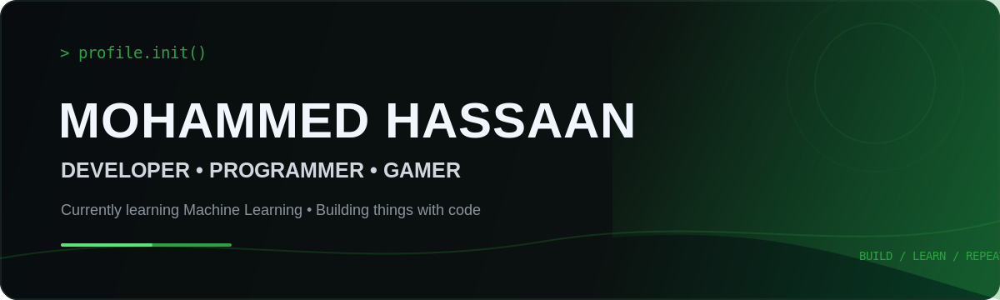

<div align="center">



<br><br>

<a href="https://github.com/MrHassaanX">
  
</a>
<a href="https://nothassan.com/">
  
</a>
<a href="mailto:asushassaan016@gmail.com">
  
</a>

</div>

<br>

<table width="100%">
<tr>
<td width="58%" valign="top">

## HELLO, I'M HASSAAN

I enjoy **coding, building, experimenting, and figuring things out**.

I like taking an idea and turning it into something that actually works — from web projects and software experiments to whatever I'm curious about next.

**Currently learning:** Machine Learning

**Currently building:** Web & software projects

**Always improving:** Programming, problem solving & development

</td>

<td width="42%" valign="top">

### QUICK PROFILE

```text
NAME        Mohammed Hassaan
ROLE        Developer
            Programmer
            Gamer

FOCUS       Machine Learning
BUILDING    Web + Software
MINDSET     Learn → Build → Improve
```

</td>
</tr>
</table>

---

## THE CURRENT MODE

<table width="100%">
<tr>
<td align="center" width="25%">

### 01
**LEARN**

Machine Learning  
AI / ML concepts

</td>
<td align="center" width="25%">

### 02
**CODE**

Write  
Experiment  
Solve

</td>
<td align="center" width="25%">

### 03
**BUILD**

Web projects  
Software  
Ideas

</td>
<td align="center" width="25%">

### 04
**SHIP**

Make it work  
Make it better  
Repeat

</td>
</tr>
</table>

---

## TOOLS I WORK WITH

<div align="center">


<br><br>

`C` · `C++` · `HTML` · `CSS` · `JavaScript` · `Java` · `Python` · `Node.js` · `Google Cloud` · `Photoshop` · `Illustrator`

</div>

---

## CONTRIBUTION SNAKE

<div align="center">


<br>

<sub><b>Every commit leaves a trail.</b></sub>

</div>

---

## GITHUB ACTIVITY

<div align="center">

<a href="https://github.com/MrHassaanX">

</a>

<a href="https://github.com/MrHassaanX">

</a>

<br><br>


</div>

---

## A FEW THINGS ABOUT ME

<table width="100%">
<tr>
<td align="center" width="33%">

### 🎮 GAMER

Coding isn't the only thing I spend time on.

Games are part of the routine too.

</td>
<td align="center" width="33%">

### 🧠 CURIOUS

If something looks interesting,
I'll probably try to build it,
break it, or learn how it works.

</td>
<td align="center" width="33%">

### ❤️ PLOT TWIST

**She is the cutest :))**

No further questions.

</td>
</tr>
</table>

---

## FIND ME AROUND THE INTERNET

<div align="center">

[🌐 **Portfolio**](https://nothassan.com/)  
[📸 **Instagram**](https://instagram.com/_ha.zzy__) ·
[💼 **LinkedIn**](https://www.linkedin.com/in/mrstax) ·
[▶️ **YouTube**](https://youtube.com/@UCVlWxM5kqNCNmCF8gVpRW2w) ·
[💬 **Discord**](https://discord.com/) ·
[☕ **Buy Me a Coffee**](https://buymeacoffee.com/mrstax)

<br><br>

### `DEVELOPER • PROGRAMMER • GAMER`

<sub>Learn something. Build something. Ship something.</sub>

<br><br>


</div>
